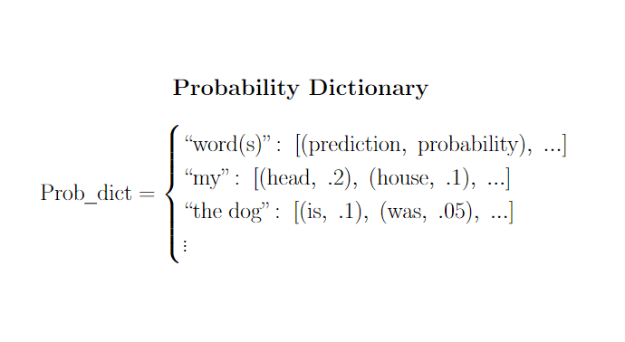

# Markov Text Generation
## C.A.R.L. (Computer Assisted Real Language)
Just some boys tying to make a mediocre auto text completion software using the powers given to us from Carl McTague. 

## Overview

#### 1. Source-Text Collection
C.A.R.L. is a probabilistic text generator, meaning that he relies on a large database of source to form associations between words and phrases.
- Inside ```backend```, ```feed_carl.py``` is which uses takes each weblink in ```urls.txt``` and passes them ```parse.py```
  - For best use, each web page should be a simple with all of the text on one page.
- ```parse.py``` webscrapes all of the text of and parses it into a 2D list with the strucutre ```[sentence1, sentence2, ...]``` where each sentence is  ```[word1, word2,...]```


#### 2. Markov-Chain Generation
- The parsed text is passed to ```list_to_markov()``` which generates probability dictionary with the structure: ```{key_phrase : following_word_probabilities}``` where each ```following_word_probabilities``` is a list of tuples: ```[(following_word1, prob1), (following_word2, prob2),...]```
  - Each phrase has an association to all of the words that follow it and the probabilites which they occur in the source text
  - Each ```following_word_probabilites``` is essentially a dictionary itself however a list of tuples is used to sort the values in descending order by probability
- Each phrase may be 1 or many words. ```list_to_markov(text, degree)``` is configured to generate probability dictionaries for ```key_phrases```'s of size 1 through ```degree```.   
  - This allows C.A.R.L. to have greater context when looking up a word that would follow an entire a longer sentence segment.
- All of the probability dicionaries are joined together and then dumped into a json file ```dict.json```.


#### 3. Predicting and Suggesting Text
C.A.R.L. uses React.js for its UI. Therefore for ease of use, we have javascript look-up functions which utilize ```dict.json``` to generate sentences of many words (```predict_text```) or a single word (```suggest_text```). The React application uses these functions to look up words to display to to the user.

About ```predict_text(seed_key, n, constant_key_size, max_key_size)```
- Takes **seed_key** as the inital key and then generates multiple words (usually) based on the the previous **n** words (including words that predict_text generated itself)
- Paramaters: 
  - **seed_key**: seed_key is the first word (or phrase) that is used to begin text generation
  - **n**: number of words to predict in total
  - **constant_key_size**: True if key is always 1 word , false if key grows by adding words it has predicted
  - **max_key_size**: Should be set to max degree of dictionary. In case of growing key size, key size will not exceed this value
  
About ```suggest_text(seed_key, n)```
- Returns the top **n** most probable words to follow the phrase **seed_key**
- Parameters:
  - **seed_key**: seed_key is the first word (or phrase) that is used to begin text generation
  - **n**: number of words to list for suggestion


#### 4. UI
A React application where the user can type in a text box and the application will suggest following words for a user (in order of probability) or be set to produce an entire phrase based on words the user has type
- Uses the look-up functions ```predict_text``` and ```suggest_text```


## Visual Aids



## Current Testing Usage

- Make sure to install node.js
- Make sure current directory is **backend**
- run ```python main.py``` to generate dictionary *"dict.json"* (currently 1 to 5 degrees) for the urls in **"urls.txt"**
- run ```node predict_text.js``` to test text prediction with dictionary "dict.json"
  - Need to use the function ```predict_text(...)``` in react part of application 


## Using this Repository
- please be careful using github. Make sure when you push changes you are pushing your own code to the script you are working on. You can really mess stuff up if you are not careful.
- Make sure to comment inline with your code and put proper commit messages with every commit.
## Project Overview
### Proposal
 Our proposal and LaTex file.
### Write-Up
 A file for us to work on our write up to go into.
### model1
 A very hacky first implementation of the concept. 
## To-Do
- Data Scraping for training text
   - **STILL BROKEN SOMETIMES**
- Parsing Data needs to be fixed
- Front end and JS prediction logic
   - Prediction is mostly done
- Finalizing Chain formatting and structure
- Do hard math on probibility of back and foward calculation 
