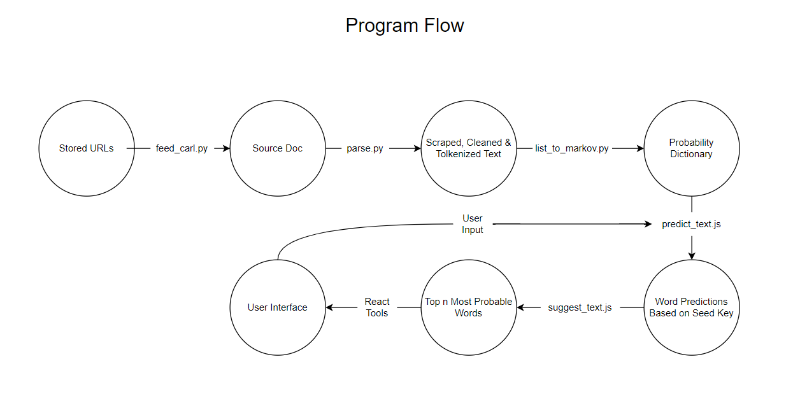

# Markov Text Generation
## C.A.R.L. (Computer Assisted Real Language)
Just some boys tying to make a mediocre auto text completion software using the powers bestowed upon us by Carl McTague. 

## Overview

#### 1. Source-Text Collection
C.A.R.L. is a probabilistic text generator, meaning that he relies on a large database of source to form associations between words and phrases.
- Inside ```backend```, ```feed_carl.py``` takes each weblink in ```urls.txt``` and passes them to ```parse.py```
  - For best use, each web page should be simple HTML with all of the text on one page.
- ```parse.py``` webscrapes all of the text and parses it into a 2D list with the strucutre ```[sentence1, sentence2, ...]``` where each sentence is  ```[word1, word2,...]```


#### 2. Markov-Chain Generation
- The parsed text is passed to ```list_to_markov()``` which generates a probability dictionary with the structure: ```{key_phrase : following_word_probabilities}``` where each ```following_word_probabilities``` is a list of tuples: ```[(following_word1, prob1), (following_word2, prob2),...]```
  - Each phrase has an association to all of the words that follow it and the probabilites with which they occur in the source text
  - Each ```following_word_probabilites``` is essentially a dictionary itself however a list of tuples is used to sort the values in descending order by probability
- Each phrase may be 1 or many words. ```list_to_markov(text, degree)``` is configured to generate probability dictionaries for ```key_phrases```'s of size 1 through ```degree```.   
  - This allows C.A.R.L. to have greater context when looking up a word that would follow a longer sentence segment.
- All of the probability dicionaries are joined together and then dumped into a json file ```dict.json```.


#### 3. Predicting and Suggesting Text
C.A.R.L. uses React.js for its UI. For ease of use, we have javascript look-up functions which utilize ```dict.json``` to generate sentences of many words (```predict_text``` or ```predict_text2```)  or a single word (```suggest_text```). The React application uses these functions to look up words to display to the user.

##### About ```predict_text(seed_key, n, constant_key_size, max_key_size)```
- Takes **seed_key** as the inital key and then generates multiple words (usually) based on the the previous **n** words (including words that predict_text generated itself)
- Not currently implemented (Should be used for a much larger dictionary)
- Paramaters: 
  - **seed_key**: seed_key is the first word (or phrase) that is used to begin text generation
  - **n**: number of words to predict in total
  - **constant_key_size**: True if key is always 1 word , false if key grows by adding words it has predicted
  - **max_key_size**: Should be set to max degree of dictionary. In case of growing key size, key size will not exceed this value

##### About ```predict_text2(data, words, max_key_size)```
- Used in React UI
- uses **words** array to randomly generate 1 prediction in **data** 
  - Attempts to use final **max_key_size** words in **words** but will use fewer context words if no searches are available
- Paramaters: 
  - **data**: lookup dictionary
  - **words**: array of words that will be used to form seed_key (key for looking up in dictionary)
  - **max_key_size**: Should be set to max degree of dictionary. In case of growing key size, key size will not exceed this value
  
##### About ```suggest_text(seed_key, n)```
- Returns the top **n** most probable words to follow the phrase **seed_key**
- Parameters:
  - **seed_key**: seed_key is the first word (or phrase) that is used to begin text generation
  - **n**: number of words to list for suggestion


#### 4. UI
A React application where the user can type in a text box and the application will suggest following words for a user (in order of probability) or which can be set to produce an entire phrase based on words the user has typed
- Uses the look-up functions ```predict_text``` and ```suggest_text```


## Visual Overview


## Current Testing Usage

- Make sure current directory is **reactapplication/src/backend**
- Run ```python main.py``` to generate dictionary *"dict.json"* (currently 1 to 3 degrees) for the urls in **"urls.txt"**
- Set current directory to **reactapplication/src**
- Run ```npm start``` to launch ReactApplication (User Iterface)
  - Connect to **http://localhost:3000/MarkovTextGeneration** in your browser

Alternatively:
- Go to **https://austindelatorre.github.io/MarkovTextGeneration/** in your browser to view the deployed version


## Improvements

- Limitations on JS loading large json files limit the size of a dictionary
- Accuracy / Intellegence of C.A.R.L. could be improved with a larger dictionary

## Authors

Cole Dumas (cadumas01)
- Contributions: Dictionary creation, Dictionary lookup functions, UI


Austin de la Torre (austindelatorre)
- Contributions: Text-scraping and parsing, CLI, Basic Model


Colin Martin (colimartin)
- Contributions: Webscraping


Matt Murno (MattMurn0)
- Contributions: UI


Dylan Leddy (leddyd)
- Contributions: Text-scraping and parsing
